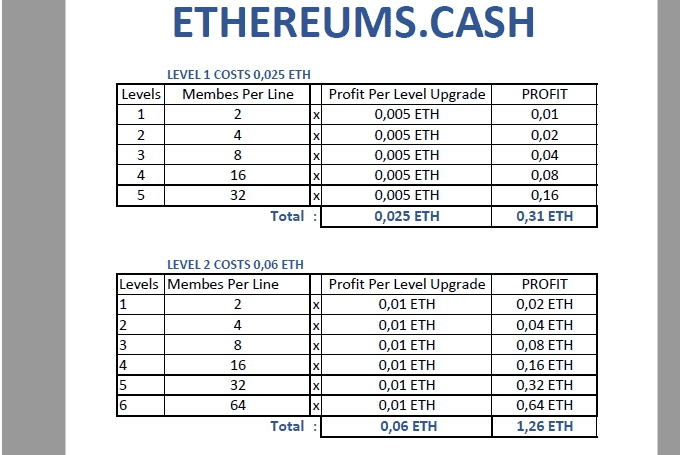

---
title: "ETHEREUMS•CASH"
description: "以太坊多支付 Dapp"
date: 2022-08-16T00:00:00+08:00
lastmod: 2022-08-16T00:00:00+08:00
draft: false
authors: ["boogArno"]
featuredImage: "ethereums-cash.png"
tags: ["High risk","ETHEREUMS•CASH"]
categories: ["nfts"]
nfts: ["High risk"]
blockchain: "ETH"
website: "https://ethereums.cash/"
twitter: ""
discord: ""
telegram: ""
github: ""
youtube: "https://www.youtube.com/watch?v=0v9gRl9JyVs"
twitch: ""
facebook: ""
instagram: ""
reddit: ""
medium: ""
steam: ""
gitbook: ""
googleplay: ""
appstore: ""
status: "Live"
weight: 
lightgallery: true
toc: true
pinned: false
recommend: false
recommend1: false
---
ETHEREUMS•CASH：独特的智能以太坊区块链合约，这是第一个具有多重支付能力的合约，您可以使用Metamask或Trust钱包注册，只需0.025 ETH。您在 180 天内赚取高达 55000 ETH

ETHEREUMS•CASH 统计
该数据代表被跟踪智能合约的原始链上活动
24小时
7天
30天

