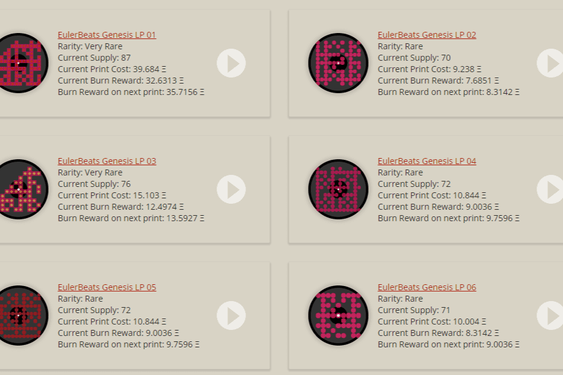

Euler Beats 是一个链上音乐 NFT 项目，有 27 首原创曲目，每首曲目 120 个副本。这些音乐 NFT 赋予所有者对音乐的商业权利，此外，他们从该特定歌曲的每份销售中获得 8% 的版税。
铸造原件的过程是在链上发生的。代币种子用于创作歌曲，因此买家无法预览艺术或节拍。
从每笔销售中，原版所有者获得 8%，而创作者则获得 2%。剩下的 90% 用于销毁合同。在任何时候，有人可以将他们的歌曲副本发送到刻录合同，他们将从刻录合同中获得最后 90% 的费用。

