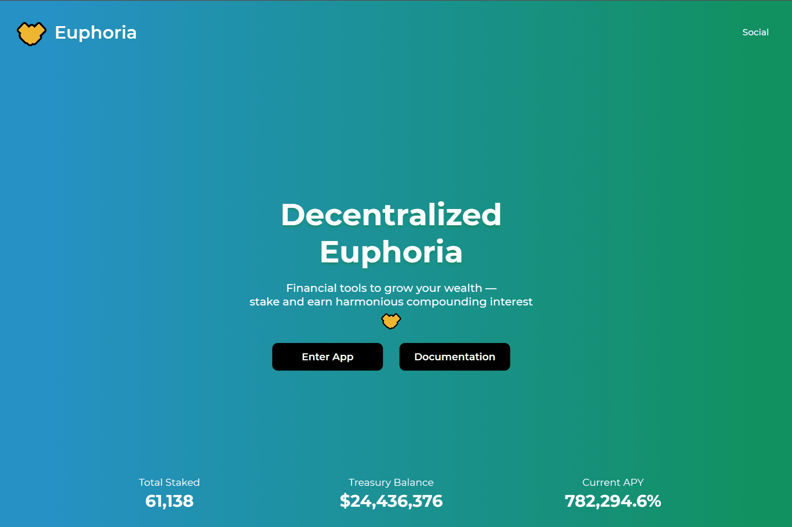

Euphoria (WAGMI) 是 VenomDAO 下的一种算法储备货币协议，最初将作为 OHM & Wonderland 的一个分支开始。
我们打算将我们内部的 AMM DEX ViperSwap 与 Euphoria 结合起来，试图弥合 DeFi1.0 的流动性挖矿机制和 DeFi 2.0 的协议拥有的流动性机制之间的差距。
为什么 WAGMI 作为代币代码/符号？我们相信这个项目的核心原则将依赖于合作（🤝，🤝），也更广泛地称为（3，3）。

