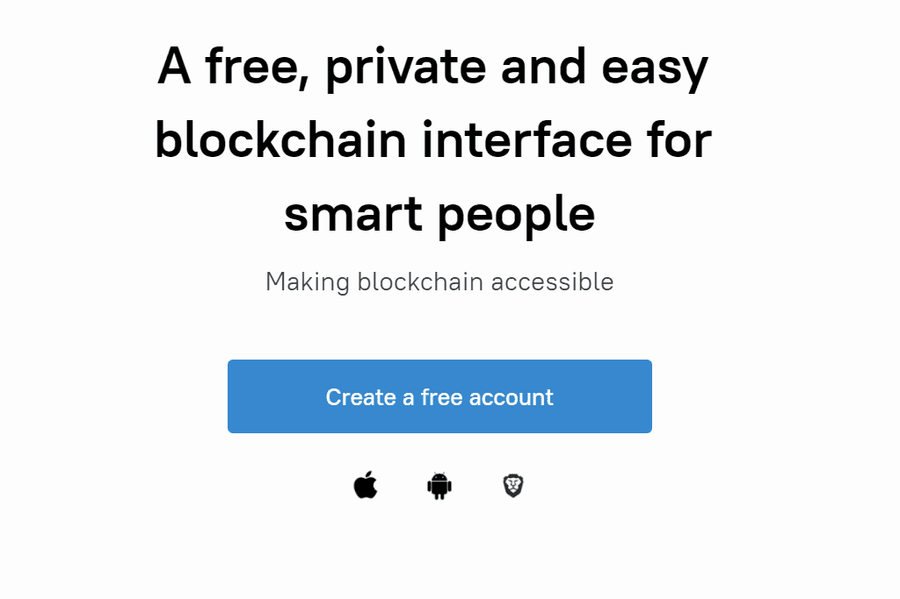

Surf 是与 Everscale 区块链交互的一体化且最受信任的应用程序。

  在非托管应用程序钱包中安全地存储、转移和接收代币
  内置加密聊天
  质押和 DePools。存入代币并享受您的质押奖励。不要错过参与 Boosted Staking 计划的机会
  试试 DeBots，Everscale 区块链去中心化应用，帮助你使用更多区块链功能
  多重签名账户
  安全卡支持，不仅仅是硬件钱包
  存储、发送和接收 NFT
  通过信用卡支付充值您的钱包余额
  带有二维码的冲浪支付选项
  多语言支持

与 Surf 的所有交互都符合安全标准，并受到端到端加密的保护，可防止第三方获取数据。 Surf 不会收集或存储您的个人数据。
在 Apple Store、Google Play 中浏览应用程序或在网络浏览器中使用它。

