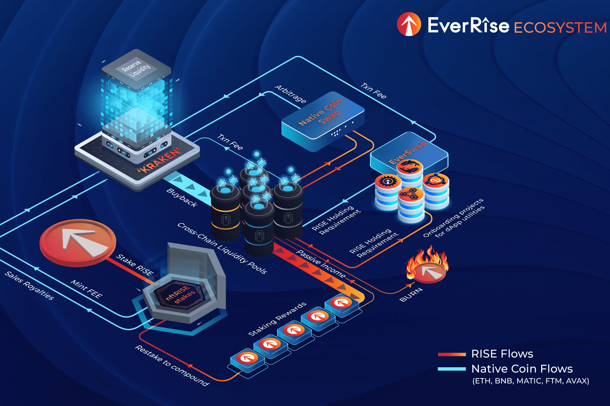

EverRise 生态系统提供了一套去中心化应用程序 (dApp)，为 DeFi 领域的项目和投资者提供安全解决方案。
在 EverRise，我们认为所有投资者都应该确保他们投资于合法项目，并且所有合法项目都应该有机会被投资者考虑。
我们的使命是为投资者提供对其 DeFi 投资的控制权和信心，同时使开发人员能够赢得投资者的信任。
我们的 dApp：EverOwn、EverBridge、EverWallet、EverSwap、EverLock 和 EverSale 将为个人和项目安全带来新的维度。所有 dApp 都将提供给 Binance 智能链 (BEP-20)、以太坊区块链 (ERC-20) 和 Polygon 区块链。

