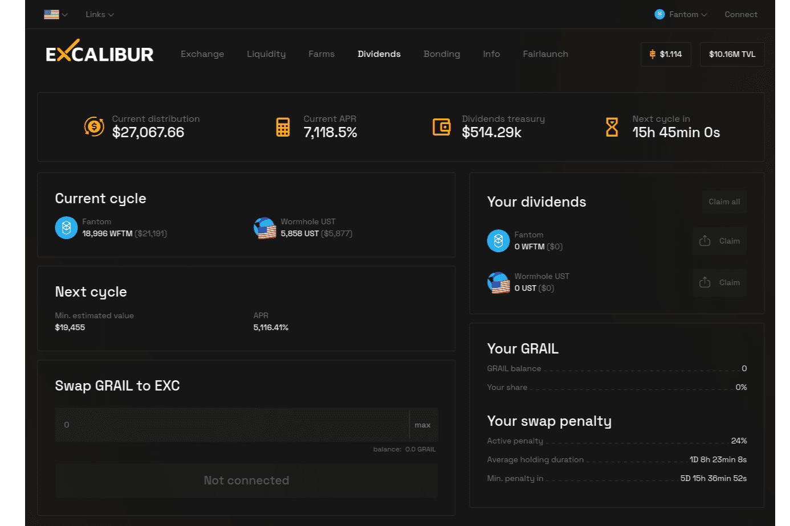

Excalibur Exchange 是一个基于 Fantom 的 DEX，专注于可持续性、资本效率和支持新项目。可持续性一直是 DeFi 领域的一个问题，因为资本遵循激励措施，需要适当配置激励措施以鼓励资本长寿；这是 Excalibur 的一大重点，我们通过动态激励长期抵押和产生收益的治理令牌与流动性奖励等分离来做到这一点。 Excalibur 还具有高度可变的掉期费用和各种其他机制来支持 Fantom 上的新项目。

