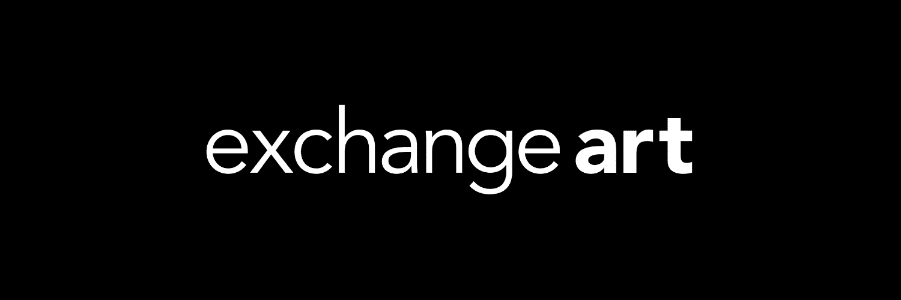

一个易于使用、实用且方便的 Solana NFT 市场，适合所有人！

我们只有一个星球。
在不破坏环境的情况下买卖艺术品。

通过在 Solana 区块链上构建，每笔交易使用的能源少于 2 次 Google 搜索。

艺术交流 埃塞克斯大学 Wivenhoe Park Colchester CO4 3SQ 电话：01206 873184 gallery@essex.ac.uk。跟随。加入我们的邮件列表。

