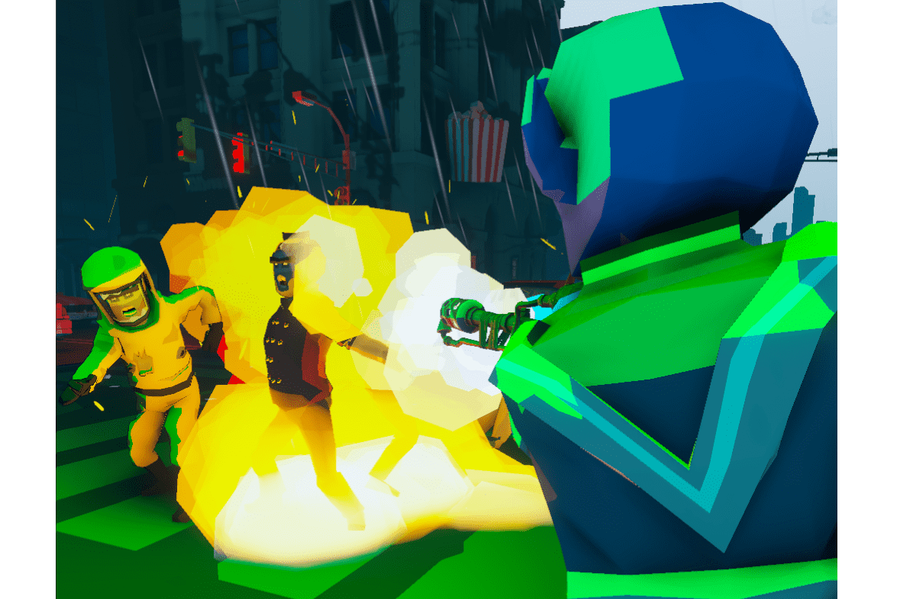

Fantom Survivor 是一款跨链、web3、P2E、第三人称僵尸射击游戏，你可以在其中扮演你的幸存者 NFT。它目前在 Fantom Opera 网络和 Avalanche 上，并计划扩展到其他连锁店。扮演你的 Fantom Survivor NFT 并在成群的受感染加密货币中生存下来。当你进入这个后世界末日的世界时，你的幸存者将只配备一把手枪。你的任务是尽可能长时间地生存。所有分数都通过我们的排行榜记录，您可以通过这些排行榜与其他玩家进行每周挑战。您将面临许多不同的敌人，他们的力量各不相同。您必须消灭敌人，同时通过武器保险箱管理弹药、收集代币和解锁新武器。拥有幸存者可以让您进入一个不断发展的世界。

