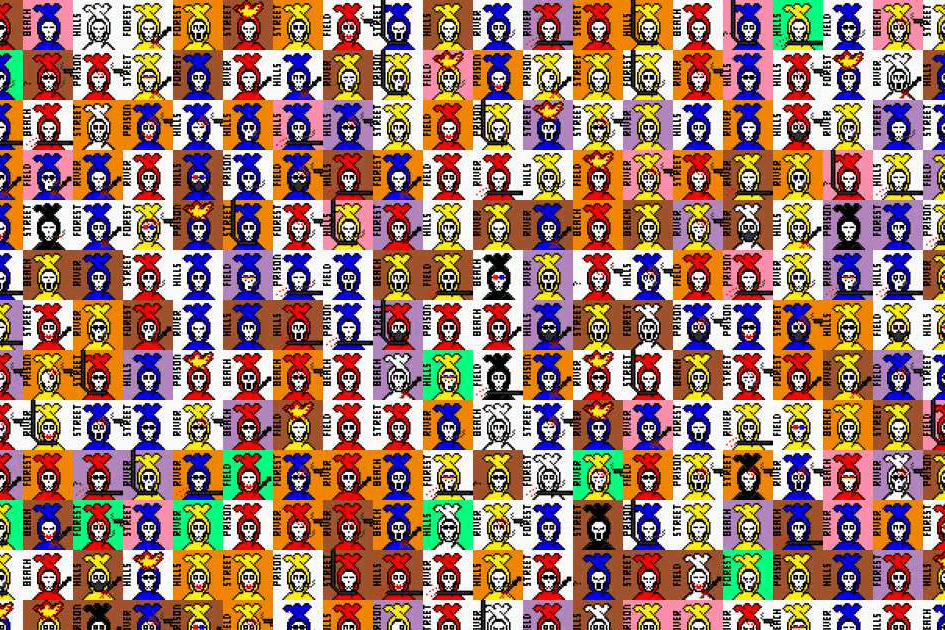

在这个充满异国情调的祖国，从15世纪开始，当地人开始用裹尸布包裹死者的尸体，而不是烧死他们。他们的灵魂只有在被埋葬 40 天后才会离开地球，在一个条件下：裹尸布被解开。
在接下来的五六个世纪里，骚乱持续了五十年。无论是在昏暗的月光下还是在明媚的阳光下，到处都发生着屠杀。受害者数不胜数，有人说五十万，有人说超过一百万。可以肯定的一件事是没有足够的空间和时间将它们全部埋葬。
很多关系都没有解开。尸体化作鬼魂，从坟墓中跳了出来，变成了一个破洞。其中有 10,000 人跳到了 Fantom。

