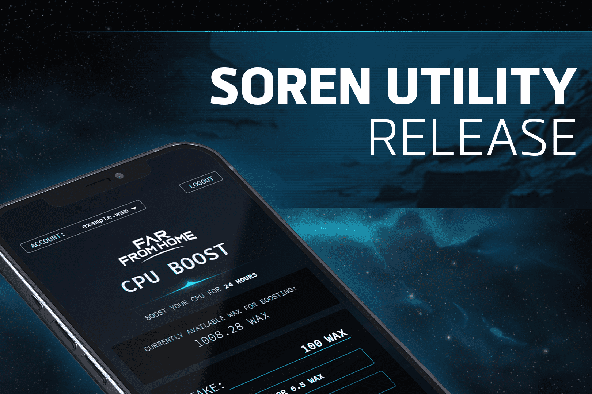

Far From Home 是一款即将推出的基于太空的 DeFi 元宇宙游戏，它将挑战玩家在未知的浩瀚宇宙中挖掘、建造和战斗。
Far From Home 世界中一个关键的价值驱动因素是通过各种游戏内活动实现的玩家驱动型经济。这些活动将包括，例如：土地所有权、采矿、提炼、任务、手工艺、建筑、太空探索、深空探索、PVP 战斗、进度系统、成就和赌注。
虚拟世界经济的主要目标是使商品生产与长期进步和短期享受的感觉保持一致，同时为了玩家和公司/组织/公会的利益而进行必要的合作

