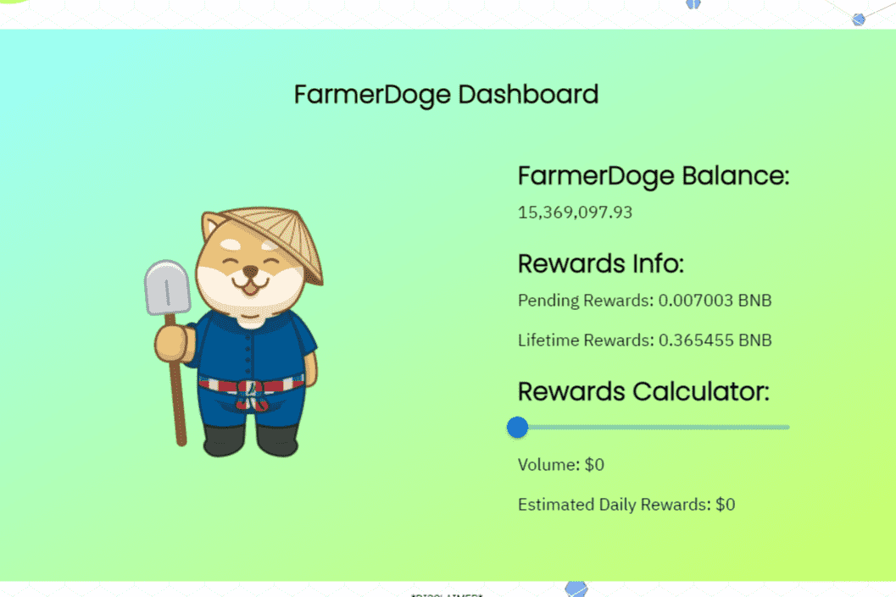

Farmer Doge 是世界上第一个多币种奖励代币。这使我们能够在 Binance 智能链上种植任何加密货币。购买&amp;持有 Farmer Doge，让团队加密货币分析师使用前 200 种加密货币和加密货币构建您的投资组合。新推出的登月计划。

FarmerDoge V3 本周呈下降趋势。
FarmerDoge V3 的价格在过去 7 天内下跌了 8.55%。价格在过去 24 小时内下跌了 0.27%。在过去的一个小时内，价格缩水了 0.13%。当前价格为每株作物 0.00118 港元。 FarmerDoge V3 比历史高点 0.156823 港元低 99.25%。

