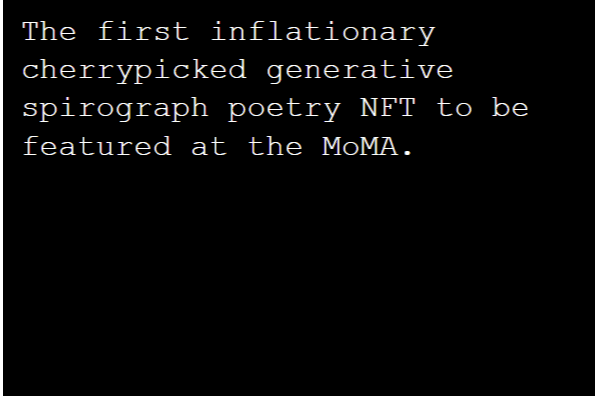

第一个关于 NFT 的链上生成文本 NFT。

FIRST 是讽刺性生成文本的集合。它既嘲笑又深情地纪念了大约 2021 年 9 月 NFT 加密文化的许多方面。所有初级销售和二级销售的版税都捐赠给 GiveDirectly.org 慈善机构。

FIRST 是讽刺性生成文本的集合。它既嘲笑又深情地纪念了 2021 年 9 月左右 NFT 加密文化的许多方面。

以太坊区块链的历史数据丰富，可以追溯到 2015 年。从那时起，NFT 和以太坊区块链发生了很多事情。从 ENS 到 Axie Infinity，它们都在以太坊区块链和宏观 NFT 空间的发展中发挥了作用。

感谢 Leonidas.eth，我能够收集在 Etherum 区块链上创建的一些最重要的 NFT 列表。但是，此列表不包括 Leonidas 时间轴上的每个 NFT。

