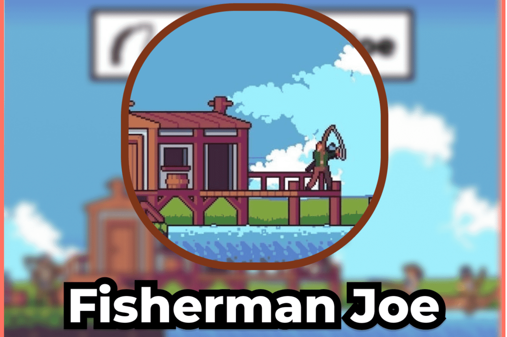

乔是一名渔民，他希望通过雇用更多渔民来发展自己的业务。乔雇佣的每个渔夫都会把新鲜的鱼带到餐桌上，这些鱼可以卖给 TGC。
该合约是开源的，在 BscScan 上可见。它是无地毯且不可变的，这意味着开发人员无法使用任何功能来消耗或更改其操作。 Fisherman Joe 合约余额变为零的可能性极小，因为我们的最大每日回报率为 3%，并且考虑到许多用户定期将其每日回报率复利以获得更大的未来利润。

