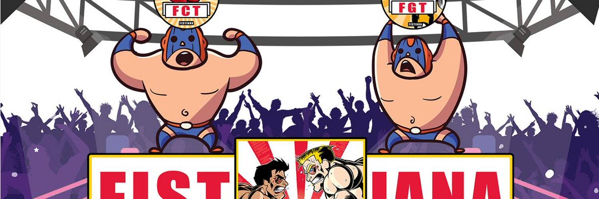

FISTIANA是一款体育娱乐Dapp，未来将搭载基于Web3.0的可穿戴设备，实现身临其境的游戏体验。
FISIANA 内嵌 Game-Fi 和 Social-Fi，不受地域和时间限制，让玩家在享受体育娱乐的同时获得丰厚的代币奖励。玩家只需要选择自己的战士即可参与FISIANA的任何模式。活动结束后，用户将获得相应的代币奖励。这将鼓励玩家积极战斗并参与奖励驱动的活动，最终将 FISIANA 打造为一个整合社交和游戏元世界的平台。

