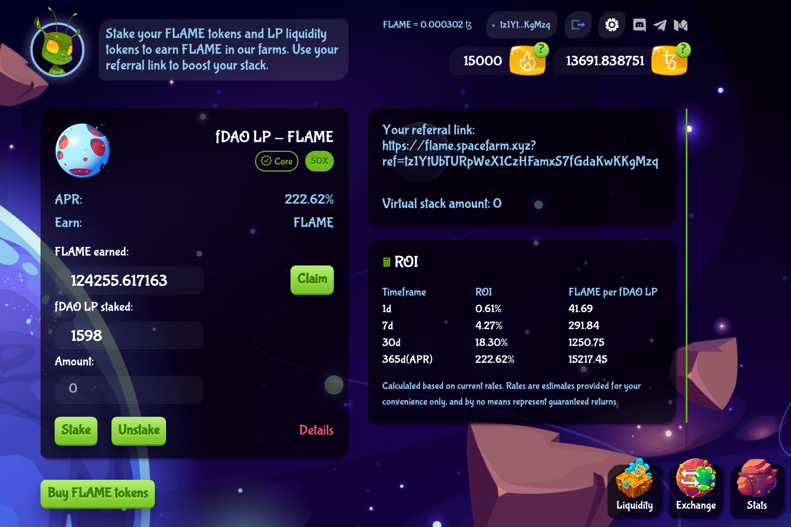

FlameDefi 是一个基于 Tezos 区块链的项目，它结合了：
- 经典 DEX
- 单产农业
- 游戏
FlameDeFi 支持 Tezos 区块链上的其他项目。 Tezos 上的任何项目都可以将他们的农场添加到我们的 SpaceFarm 中，从而显着提高用户的知名度和信任度。在我们的 SpaceFarm 上，新农场的数量不断增加，这表明该平台的受欢迎程度。用户还有机会通过推荐计划赚钱。 FlameDeFi 正在逐渐演变和变化，让所有用户都在等待不久的将来有新的发现。

