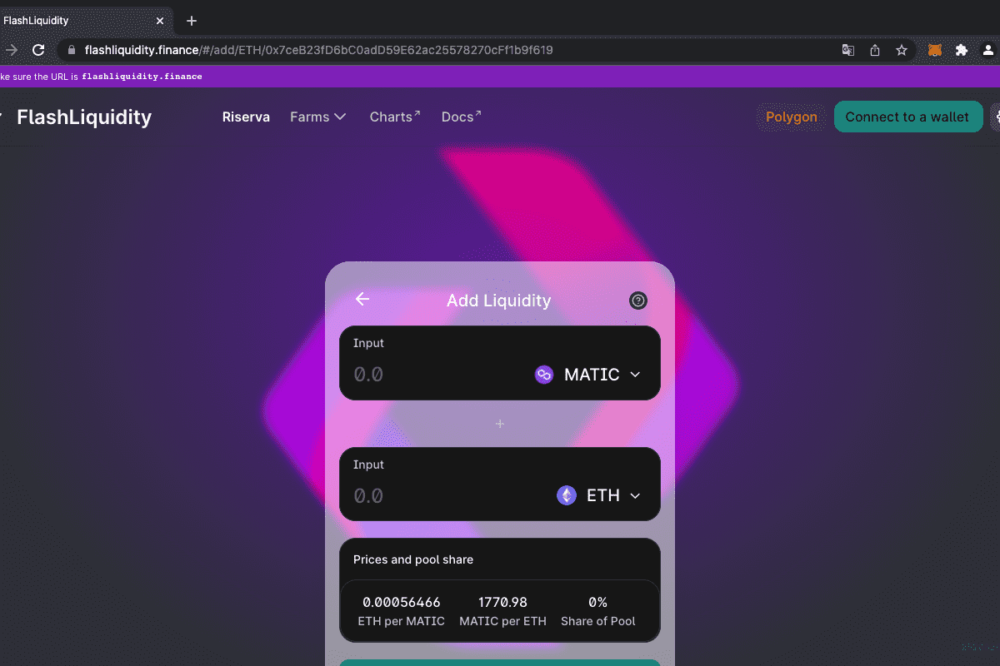

FlashLiquidity 是运行在 Polygon 主网上的去中心化 AMM 交易所。
该协议的主要区别在于，流动性提供者可以获得交易量的 0.25% 的费用以及与保持流动性池平衡相关的套利利润。
在 FlashLiquidity 上，流动性对可以公开交易或分配到特权地址，在该地址部署“FlashSwapper”合约以处理 Flash 掉期执行逻辑并将套利利润分配给流动性提供者。
在部署了 FlashSwapper 合约的情况下，闪兑只能由授权地址执行——阻止可能与 FlashSwapper 合约执行的自动闪兑竞争（通过抢先交易）的外部套利者。
这有效地使得将所有套利利润分配给流动性提供者而不是独立的套利者成为可能。

