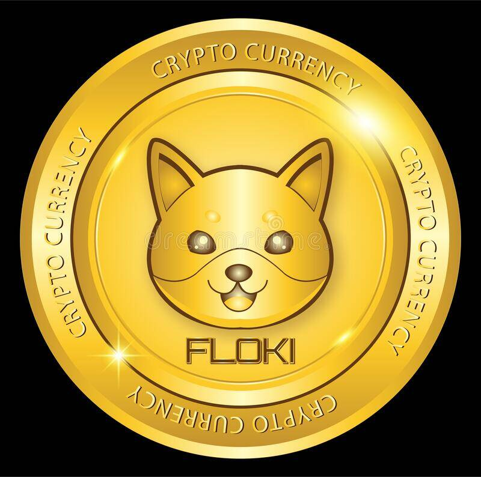

---
title: "FlokiTOken"
description: "Floki 是社区驱动的去中心化加密货币，为持有者提供即时奖励。您只需持有即可赚取更多 $FlokiToken。"
date: 2022-08-17T00:00:00+08:00
lastmod: 2022-08-17T00:00:00+08:00
draft: false
authors: ["boogArno"]
featuredImage: "flokitoken.png"
tags: ["High risk","FlokiTOken"]
categories: ["nfts"]
nfts: ["High risk"]
blockchain: "BSC"
website: "https://floktoken.com/"
twitter: "https://twitter.com/FlokiTokenBSC"
discord: ""
telegram: ""
github: ""
youtube: ""
twitch: ""
facebook: ""
instagram: ""
reddit: ""
medium: "https://t.co/CWbl8UdgJg?amp=1"
steam: ""
gitbook: ""
googleplay: ""
appstore: ""
status: "Live"
weight: 
lightgallery: true
toc: true
pinned: false
recommend: false
recommend1: false
---
从前，有一只非常特别的狗。那条狗是一只 Floki，这条狗启发了全世界数以百万计的人将资金投入到带有狗形象的代币中。
根据#FlokiArmy 的说法，FLOKI 是“狗狗币杀手”，并将在他们自己的 NFT 市场和彩票系统中列出。
FlokiToken 是专注于 NFT 市场和彩票系统的狗爱好者的 meme 令牌。

