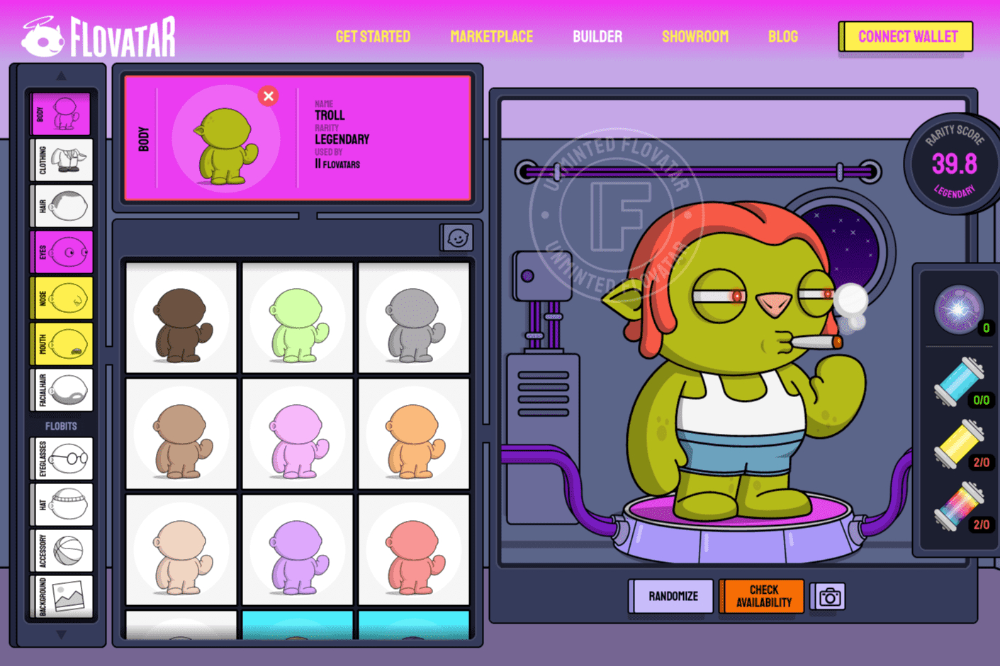

Flovatar 正在开创一种在 Web3 中释放社区创造力的新方法，它允许用户成为其珍贵 NFT 的共同创造者，而不仅仅是被动的收集者。它为消费者提供了一个创新平台，让他们一起建立新的体验。与第一代 NFT 项目不同，Flovatar 为普通消费者提供了低摩擦和游戏化的初始体验；其模块化、可组合和跨代的基础将使其能够轻松扩展到垂直领域（游戏、娱乐、元界）。
还要感谢我们的 Flobits（可以为任何 Flovatar 配备的 NFT 配件）以及我们开创性的创新，如交互式、动画和全链 SVG 图形，我们已经在突破 NFT 2.0 的界限。早点加入我们这个令人难以置信的冒险。

