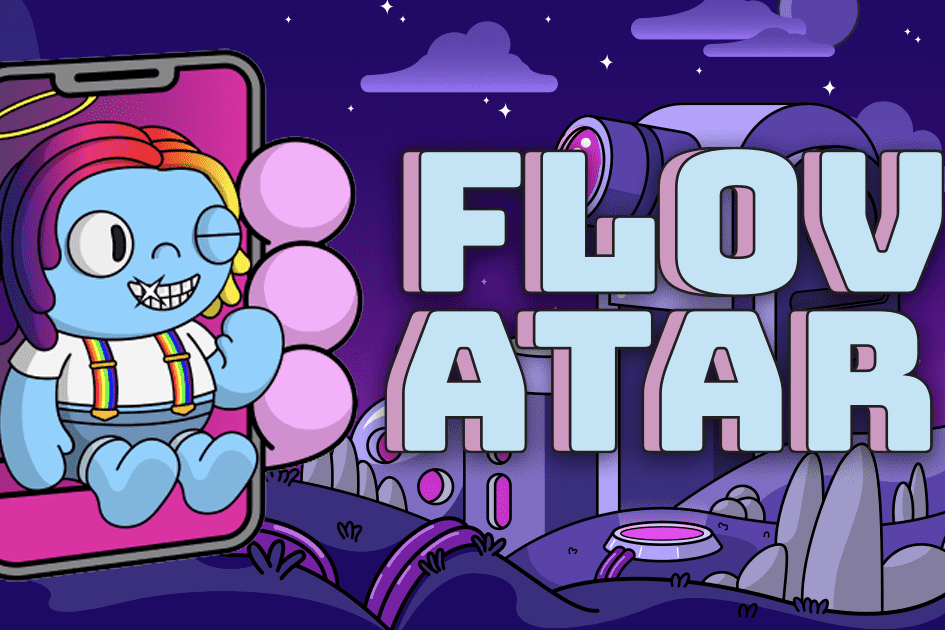

Flovatar 是下一代 PFP 项目，建立在 Flow 之上，收藏家在其中发挥创意，塑造自己独特的角色。参与者将能够在超过 1000 亿种不同组合的七个主要类别中选择他们最喜欢的组合。不再需要在稀有度和您自己的个性之间进行权衡。 （只有 9,999 可以作为原始系列铸造）
虽然区块链的基本价值在于交易的最终确定性（不可逆）和真正的数字所有权，但 NFT 没有理由必须永远保持静态和不可变。使用 Flovatar，您可以创建您最喜欢的 PFP NFT，它对您来说最有说服力，同时由于各种稀有性特征而仍然提供可收藏性因素，并保证是独一无二的。借助 Flovatar，签名和 SVG 艺术本身将永远存在于链上。
Flovatar 创作者将在未来转售其 Flovatar 时获得 1% 的特许权使用费，并且每个 Flovatar 的当前所有者将获得完整的 IP 商业权利。

