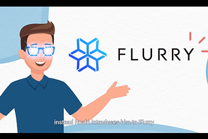

我们是单产农业的未来。我们的目标是提供一种简单、高效、方便的全新单产体验，让每个人都可以参与！xxxxxxxxxx 
我们是单产农业的未来。我们的目标是提供一种简单、高效、方便的全新单产体验，让每个人都可以参与！
我们是单产农业的未来。我们的目标是提供一种简单、高效、便捷的全新收益生成体验，让每个人都可以参与！

Flurry 协议使用 rhoToken 自动化了收益耕作过程，使用户免去了在不同链上切换 DeFi 产品以通过您的存款产生收益的所有繁琐任务。作为回报，您将获得 rhotoken（rhoUSDC、rhoUSDT、rhoBUSD），您可以将其作为交换媒介进行持有、交易和消费，同时自动赚取利息——这是稳定币无法做到的。