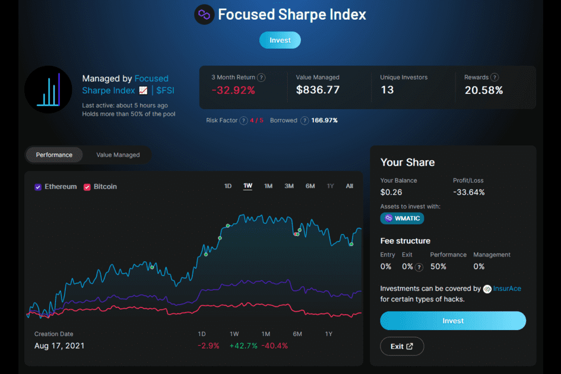

聚焦夏普指数 (FSI) 旨在保持稳定、持续的上升趋势，以努力永远超越 BTC 和 ETH。以 40% 到 60% 的百分比将 ETH 多头用于 BTC 将允许或持续 90 度上涨，风险最小。
$FSI 基金不收取入场费或退出费，而是在管理层和存款人之间分配 50% 的利润。此外，挖矿奖励是根据整体表现产生的。上述系统激励管理层始终保持所需的损益率。
$FSI 代币机制采用动态供应，仅在以 1:1 的抵押品存入基金智能合约的情况下铸造额外的单位。所述代币可以在任何时候赎回，或者由持有人自行决定在公开市场上交易。
除上述之外，所有挖出的业绩费用将重新投资到基金中，随后新挖出的池代币将被添加到 Quickswap 流动性池中，以增加套利和投资机会。