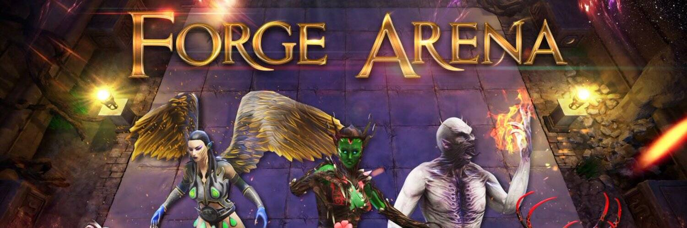

Forge Arena 是一款全新的单机游戏，可让您连续对抗四个 AI 对手，或在 PvP 中进行斗智斗勇，让您在争夺竞技场的主导权之战中组建、组合和升级团队。在这场比赛中，胜利不是由抽搐反应决定的，而是由高超的战术决定的。

我们现在处于 alpha 阶段
@PlayForgeArena
 并且测试正在进行中。这种多层自动战斗机使用 Vulcanites
@VulcanVerse
 并将包括@CoddlePets 的龙。任何加入 Vulcan 生态系统的游戏都可以添加他们的角色！