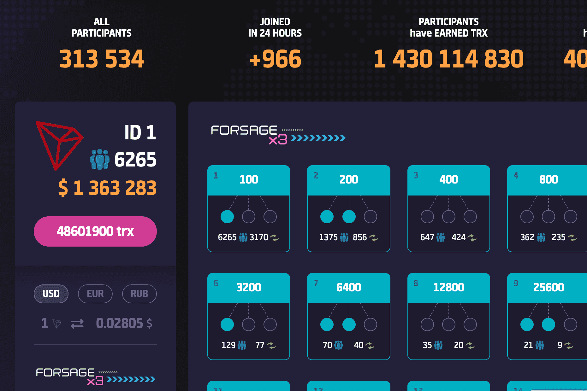

---
title: "Forsage"
description: "全球首个100%去中心化矩阵平台。"
date: 2022-08-17T00:00:00+08:00
lastmod: 2022-08-17T00:00:00+08:00
draft: false
authors: ["boodArno"]
featuredImage: "forsage.png"
tags: ["High risk","Forsage"]
categories: ["nfts"]
nfts: ["High risk"]
blockchain: "TRON"
website: "https://trx.forsage.io/"
twitter: ""
discord: ""
telegram: "https://t.me/forsage_official"
github: ""
youtube: ""
twitch: ""
facebook: ""
instagram: ""
reddit: "https://www.reddit.com/user/Forsage_io/"
medium: "https://medium.com/forsage"
steam: ""
gitbook: ""
googleplay: ""
appstore: ""
status: "Live"
weight: 
lightgallery: true
toc: true
pinned: false
recommend: false
recommend1: false
---
全球去中心化生态系统。去中心化营销由 TRON 智能合约技术提供支持。 Forsage智能合约代码完全开放，让您对项目的安全性和长期运行充满信心。
TRON 区块链的发布已经发生。然而，应许多仍对该平台感兴趣的 FORSAGE 成员的要求，以太坊上的营销计划继续运行，毕竟该项目背后的想法的作者一直将考虑每个人的利益放在首位。
TRON 是世界上最大、最快和最便宜的区块链系统之一，每秒最多可以处理 2000 笔交易（例如，ETH 每秒最多可以处理 20 笔交易）。网络费用极低，此外，TRON 开发人员一直致力于让它们更便宜：网络允许每个用户免费执行 15 次简单交易