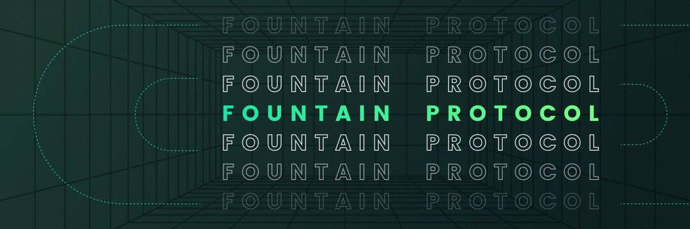

Fountain Protocol 是第一个由 Oasis 提供支持的跨链借贷平台。该协议使用户能够体验到高资本效率的 DeFi 资产一站式管理。

Fountain Protocol 是第一个由 Oasis 提供支持的跨链借贷平台。该协议使用户能够体验到高资本效率的 DeFi 资产一站式管理。 Fountain Protocol利用Oasis网络极其高效、低成本的优势，建立了以资金池为核心、多种应用场景的多收益协议。