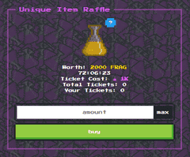

经典的硬币翻转游戏的爆炸性转折，只需选择你的一边并折腾它！通过玩这款经典游戏，为 div 挖掘 FragBonds。需要 $FRAG 代币才能玩（tron 上的 trc20 代币）

Frag Toss 是硬币翻转的类似加密的演绎。您选择两个的一侧，然后折腾-就是这样！如果您赢了，您将获得 div 的奖金。不过，该游戏需要 $FRAG 代币才能玩。这些代币可以与 ERC-20 兼容，也可以基于 TRON。