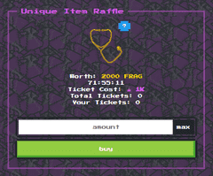

简单流畅的dex体验，让您轻松购买&amp;卖碎片！价格根据需求波动（类似于 Blaze / Bancor）。

FragDex 是一个去中心化的交易所。 paltfrom 在 TRON 区块链上构建和运行。它允许您交易和出售不同的碎片。每个碎片的价格将取决于市场需求。不需要通过 KYC 验证。

FragDex 是一个 DEX - 一个去中心化的交易所。您可以购买和出售碎片，价格取决于市场需求。