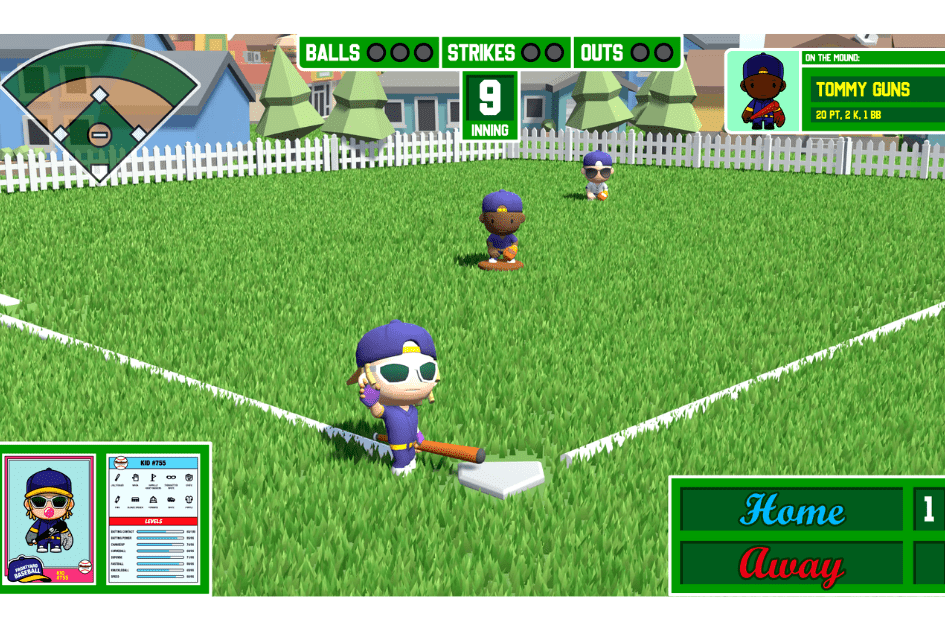

---
title: "Frontyard Baseball"
description: "一款有趣且令人兴奋的 9v9 战略棒球游戏，您可以在其中拥有自己的球员并赚取 ETH 来击出本垒打。"
date: 2022-08-17T00:00:00+08:00
lastmod: 2022-08-17T00:00:00+08:00
draft: false
authors: ["boogArno"]
featuredImage: "frontyard-baseball.png"
tags: ["NFT Games","Frontyard Baseball"]
categories: ["nfts"]
nfts: ["NFT Games"]
blockchain: "Polygon"
website: "https://dappradar.com/"
twitter: "https://twitter.com/FYbaseballNFT"
discord: ""
telegram: ""
github: ""
youtube: ""
twitch: ""
facebook: ""
instagram: ""
reddit: ""
medium: ""
steam: ""
gitbook: ""
googleplay: ""
appstore: ""
status: "Live"
weight: 
lightgallery: true
toc: true
pinned: false
recommend: false
recommend1: false
---
Frontyard Baseball 是一款有趣且令人兴奋的基于 9v9 策略的棒球比赛，您可以在其中获得自己的球员并赚取 ETH 来击出本垒打。购买您的球员，建立您的梦想球队，并在终极加密棒球比赛中成为传奇。当前铸币厂价格：0.02 ETH。 Polygon 区块链上有 25,000 个 Frontyard Kids。每个孩子都是一个拥有独特统计数据的 NFT。场上只有一个 Frontyard Kid，您可以进入游戏，甚至可以现场观看动作展开。在每场胜利中赚取 ETH。免费玩或玩加密货币！与朋友和家人一起制定计划，结识来自世界各地的人，并在玩游戏时获得奖金。玩游戏并赚取 $BSBL（棒球）代币。使用代币升级您的播放器！代币将使您获得游戏内的提升、升级等。每个铸币厂的一部分总价值为 150,000 美元，将捐赠给社区选择的青年体育慈善机构。您将在玩乐的同时产生影响。在 Frontyard games，我们正在利用区块链技术的力量为体育爱好者打造首屈一指的去中心化游戏社区。

