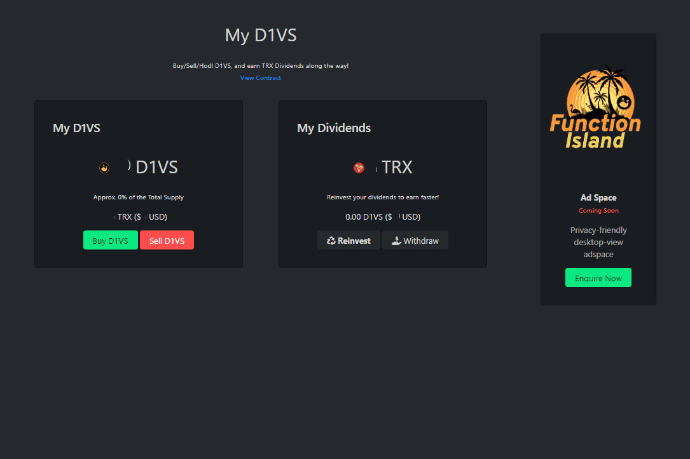

Function Island 是波场网络上的开源 Dapp 和游戏网站。
主要特点：

   D1VS 游戏 - 沙漏“弱手证明”游戏，有一个转折点：D1VS 将始终具有价值，这要归功于“Pricefloor”合同 - 赚取并持有 D1VS 但从不出售，因此您的 D1VS 具有不断增长的价值！ 每个 D1VS 的 ATH 已经达到 23 TRX，并且已经在回升的路上，D1VS 是 dapp 的一部分！

其他注意事项：
Function Island 不是一个投资平台——它是一个开源的创作和娱乐。 只使用您可以承受损失的资金，并负责任地玩游戏！

