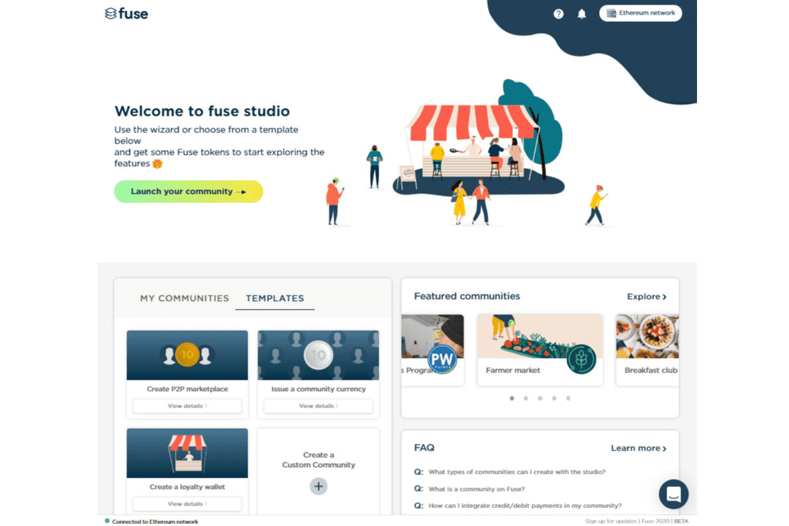

在 Fuse 的低费用、高吞吐量区块链上使用基于以太坊的资产启动经济。
通过自定义品牌个性化您的经济，铸造新代币或使用任何现有的 ERC-20 资产，通过扫描二维码邀请用户加入 Fuse 钱包。还提供特殊插件，包括斜坡上的法定货币、钱包用户奖励和奖金、商家列表等。

移动货币
传统银行业务的开源移动替代方案，允许世界任何地方的任何人访问数字支付和去中心化金融。

即插即用
一个无代码平台，供社区和企业构建新的经济模型，在低门槛沙箱中利用强大的工具和 API。

为规模而生
一个快速、分散的支付网络，提供以太坊智能合约功能，并使任何人都可以拥有基础设施的所有权。

