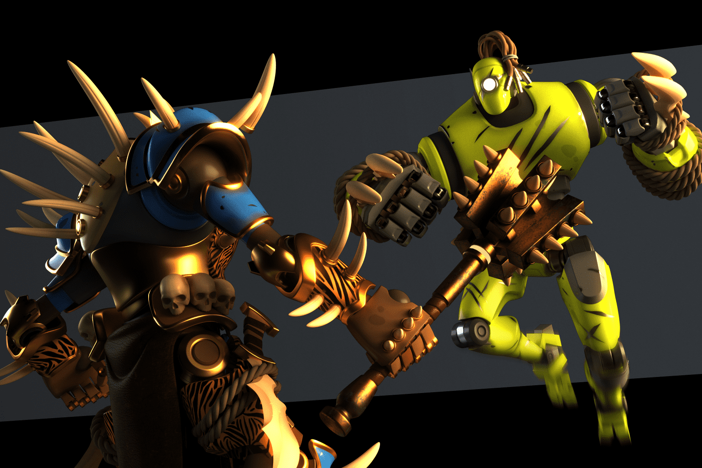

G-Bots 是基于多边形的 NFT（使用 ERC-721 标准），旨在在新的游戏时代提供终极的 Play & Earn 体验。
玩家将能够升级他们的 NFT、玩游戏、赌注并获得奖励、访问独家内容和福利，或在 G-Bots Metaverse 内的 PvP 战斗中挑战其他玩家。

$ET 为您的 G-Bot 提供燃料，让它们能够繁殖、升级和进化。它们是 G-Bots 的原生代币，可以通过在锦标赛中与它对战来获得。

战斗已经开始。参与这款惊心动魄、闪电般快速的益智游戏，颜色组合和能量提升有助于您的 G-Bot 战胜敌人。

