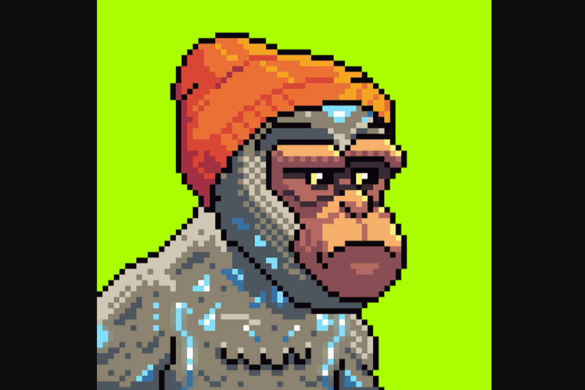

什么是银河猿？
准备好你的船员，组装你的船只，为猿猴的荣耀夺回宇宙。只有最有价值和最伟大的猿类才能从饱受战争蹂躏的星球上拯救他们的盟友，殖民新世界并从太空最深处的丰富矿藏中掠夺宝藏。

它们的成本是多少，总供应量是多少？
猿的总供应量为 9,999，每只猿的造币成本为 0.08Ξ。

什么是任务？
任务是银河猿宇宙的游戏化机制。与您的工作人员一起，您将能够完成铸造/领取其他 GalacticApes NFT 和收藏品的任务。

我需要不止一只猿来执行任务吗？
是的！对于任务，您将需要一个工作人员，但您也可以有多个工作人员同时执行不同的任务。根据您的船员组合，将比其他船员具有显着优势。

最好的船员组合是什么？
从最有利到最不利的三种船员类型将是：

总共 3 只银河猿，每个属 1 只
总共 3 只银河猿，任意组合
2 银河猿共任意组合

