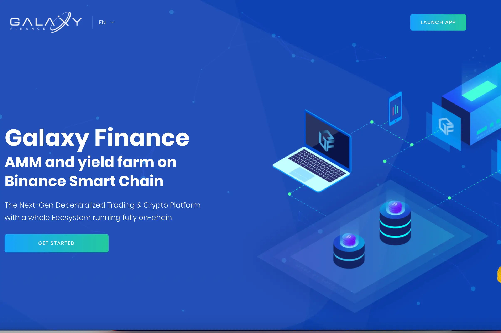

GALAXY FINANCE 正在通过我们的跨链协议、交易所、钱包和应用程序生态系统为开放金融提供动力，这些生态系统是构建下一代 DeFi 的乐高积木。
GALAXY FINANCE 是币安智能链上的下一代自动做市商 (AMM)、Staking、Yield Farming、IDO、Lauchpad 和 NFT。 $GLF 是原生货币，是 Galaxy 生态系统中平台的主要治理代币。 $GFT 是我们的太阳能监管货币。您可以在 Galaxy Dapp 上进行质押、耕种、添加矿池……并赚取 $GLF 和 $GFT。
GALAXY FINANCE 拥有一支专门的团队，致力于支持和维护整个 GALAXY FINANCE 链中的 defi 产品，他们还将参与营销和新 defi 产品的推出。这将有助于发展其生物圈，同时自发地为社区、项目和用户带来理想的收益。

