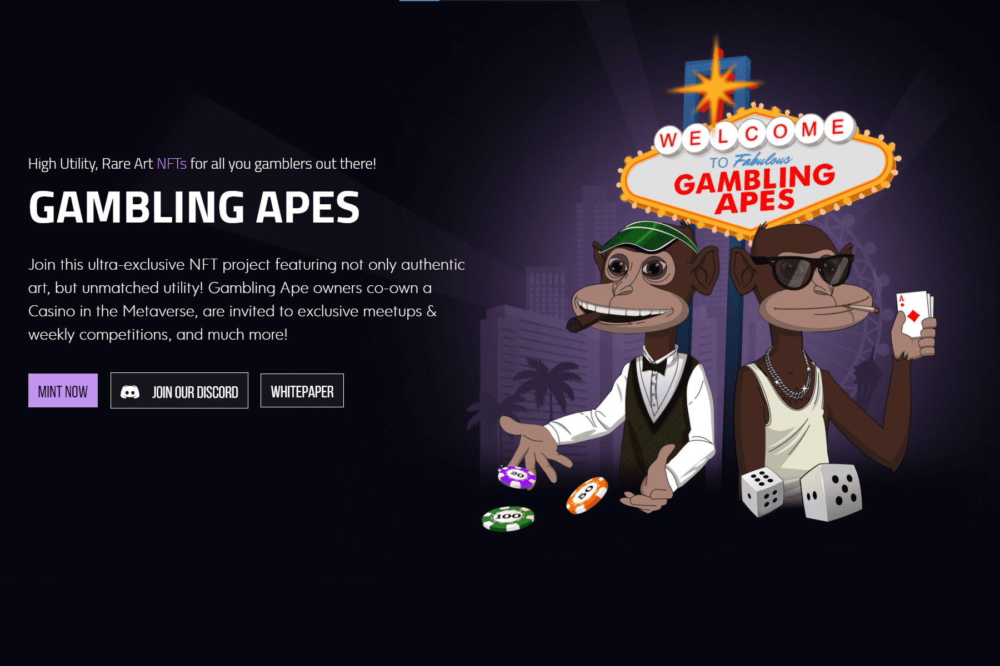

稀有度和规格
Gambling Apes 是由 120 多个特征创建的 7,777 个独特角色的集合。有些特性非常罕见，只出现一次。所有 Gambling Apes 都是定制生成的，在以太坊区块链上注册，并托管在 IFPS 上——这意味着它们永远不会被改变。
铸币厂将于 2021 年 9 月上旬举行（确切日期将很快在我们的 Discord 中公布）。在此活动期间，您可以花费 0,077 ETH 铸造您自己的 Ape。

