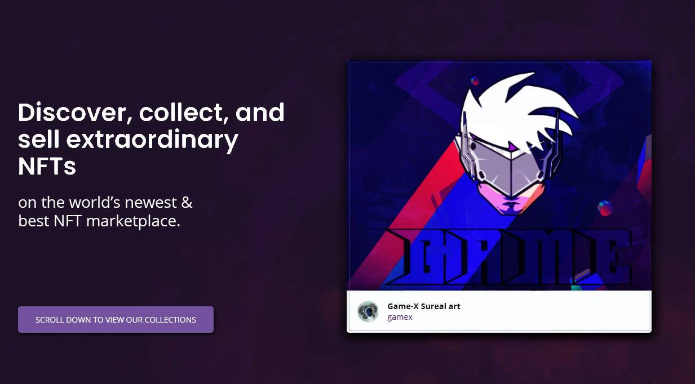

NFT Marketplace 在加密历史上第一次拥有一个治理钱包，其中一定比例的买卖费用将捐赠给癌症儿童，以便在他们之间传播快乐和健康。有什么比捐赠和帮助他人更好的呢？
NFT 市场将可用，但要做到这一点，首先必须对其进行验证，以便为我们的客户提供安全保障。除了艺术家的 NFT，我们将拥有自己的启动板，任何人都可以在其中购买我们的特别收藏 NFT，通过此次购买，人们将获得一大堆 XGameX，可以
在 GameX Swap 中使用。我们的启动平台将开放，与歌手、女演员等名人建立合作伙伴关系，当然还有加密项目。
GameX 的目标是通过这个新的生态系统达到顶峰并成为全球最好的 NFT 市场。

