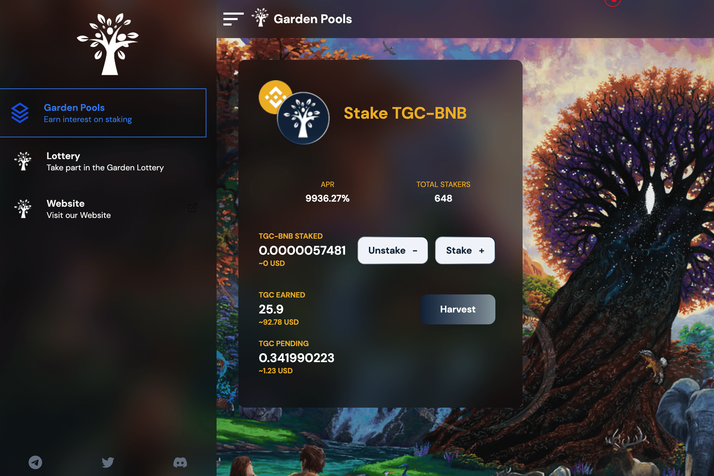

Garden Pools 是一种去中心化的质押/耕种协议，具有用户友好的界面。该平台提供高收益的LP Staking。
花园池中使用的硬币称为#TGC。
该币还可用于参与 The Garden 生态系统中的其他 Dapp。
The Garden 是币安智能链上的一个生态系统，每个人都可以在一个安全可信的环境中享受最流行的 Defi 项目/游戏，以及透明的无地毯合约。
Defi 游戏
Garden 是一个在各种区块链上分叉流行的 Defi 协议的生态系统。我们将在已经被证明很受欢迎的分叉上进行构建和改进。这些应用程序中的大多数确实具有锁定部分供应的功能，这将非常适合稳定 TGC 的价格并防止发生任何大的抛售。
治理代币
花园币（$TGC）是花园生态系统的治理代币。我们发布的每个新项目都将积极塑造协议的未来。

