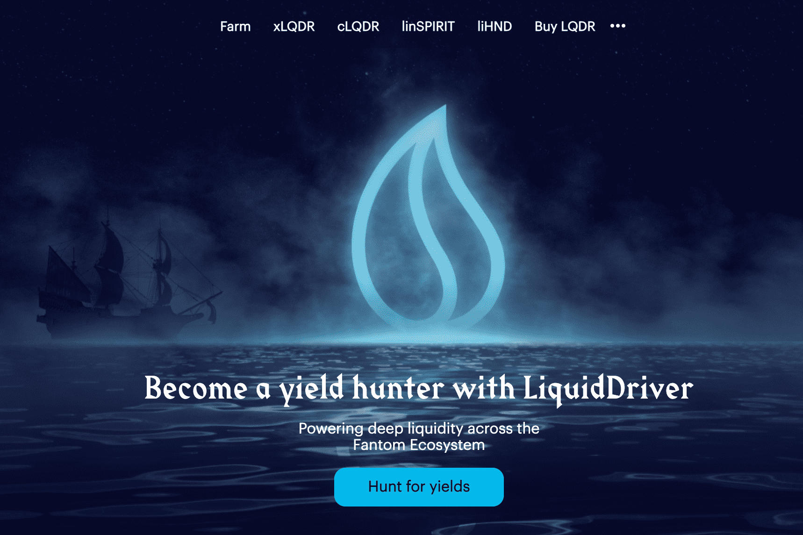

---
title: "Liquid Driver"
description: "治理黑洞和按需 LaaS"
date: 2022-08-17T00:00:00+08:00
lastmod: 2022-08-17T00:00:00+08:00
draft: false
authors: ["boogArno"]
featuredImage: "liquid-driver.png"
tags: ["DeFi","Liquid Driver"]
categories: ["nfts"]
nfts: ["DeFi"]
blockchain: "Fantom"
website: "https://www.liquiddriver.finance/"
twitter: "https://twitter.com/LiquidDriver"
discord: "https://t.co/p5bIqFir6E"
telegram: "https://t.me/LiquidDriver"
github: ""
youtube: ""
twitch: ""
facebook: ""
instagram: ""
reddit: ""
medium: "https://liquiddriver.medium.com/"
steam: ""
gitbook: ""
googleplay: ""
appstore: ""
status: "Live"
weight: 
lightgallery: true
toc: true
pinned: false
recommend: false
recommend1: false
---
Fantom 上 Sushiswap 的第一个高收益流动性挖矿 dapp
LiquidDriver 旨在防止以下情况：

  鲸鱼用大量资金操纵游戏，并向其他赌注者倾销。
  密集的代币发行最终导致价格压制。
  非 LQDR 货币对的流动性提供者承担的风险较小，并且倾向于“耕种和抛售”。

LiquidDriver 将利用四种解决方案来解决这些问题，并根据他们面临的风险按比例奖励流动性提供者：存款费用、回购、游戏化和 LQDR 的价值捕获机制。