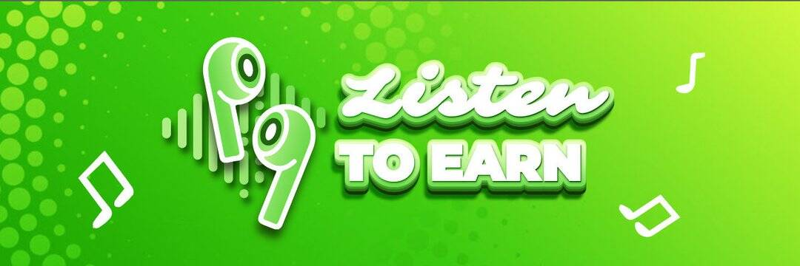

---
title: "Listen To Earn"
description: "Listen To Earn 是一个面向 Web 3.0 应用程序的项目，可让您在聆听并获得乐趣和知识的同时赚取加密货币。."
date: 2022-08-17T00:00:00+08:00
lastmod: 2022-08-17T00:00:00+08:00
draft: false
authors: ["boogArno"]
featuredImage: "listen-to-earn.png"
tags: ["NFT Games","Listen To Earn"]
categories: ["nfts"]
nfts: ["NFT Games"]
blockchain: "BSC"
website: "https://dappradar.com/"
twitter: "https://twitter.com/listenstoearn"
discord: ""
telegram: ""
github: ""
youtube: "https://www.youtube.com/channel/UCLgs2UAPXPQEIjcTojcuCBw"
twitch: ""
facebook: ""
instagram: ""
reddit: ""
medium: "https://medium.com/@listentoearn"
steam: ""
gitbook: ""
googleplay: ""
appstore: ""
status: "Live"
weight: 
lightgallery: true
toc: true
pinned: false
recommend: false
recommend1: false
---
Listen To Earn 是一个面向 Web 3.0 应用程序的项目，可让您在聆听并获得乐趣和知识的同时赚取加密货币。
以“Listen To Earn”为趋势，Listen To Earn 旨在推动数百万人走向更健康的生活方式，与社会邪恶作斗争，将公众与 Web 3.0 联系起来，同时解决其 Social-Fi 维度以建立一个长期平台 推动用户生成的 Web 3.0 内容
在不久的将来，Listen To Earn 团队将继续开发和升级 Listen To Earn 高级版。 我们将构建元界听听生态，提供各类娱乐听、学听、听听多主题的心理辅导。

