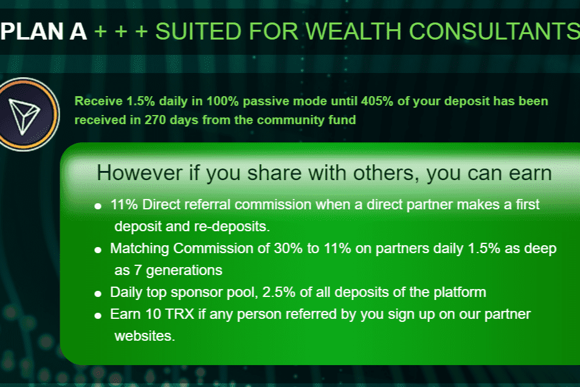

无论您是财富顾问、网络人还是个人投资者，Live with Tron 都是一项可靠的投资。 Live With Tron 是一种 DE-Fi，一种基于智能合约技术的去中心化金融支持基金，专为 Tron 区块链设计。 我们平台的 Tron Bot 有 2 个社区驱动的智能合约和 1 个自我驱动的交易计划。
Live With Tron 让您能够在绝对被动模式下赚取 Tron 加密货币，并在短时间内以完全自动驾驶的方式将您的 Tron 增长多倍。 Live With Tron 是一个可持续发展的项目，在构建时就考虑到了长寿。

