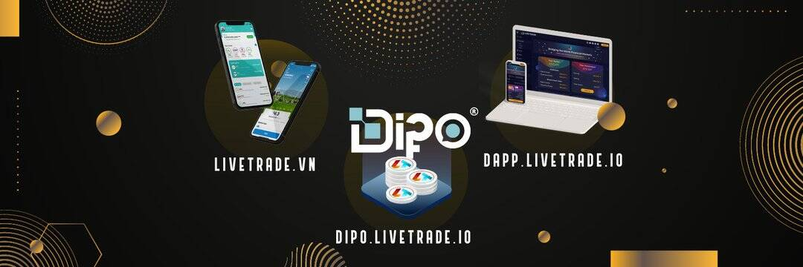

HTML

LiveTrade 生态系统允许股票和加密货币之间的持续交易。

  数字首次公开募股（DIPO）模式：通过代币化股票、债券或发行实用代币为企业和项目筹资的模式，支持潜在创意和业务的成长；
  免佣金和低资本的股票交易移动应用程序：LiveTrade 应用程序采用区块链技术对股票进行标记，使各种资本​​的用户能够购买越南优秀公司和外国公司的股票，未来，资本为低至 1 美元。交易可以24/7全天候进行，平台上用户拥有的代币化股票可以转移到实际的公司股票中进行分红；
  DeFi 平台：LiveTrade DApp 是一个基于多链的平台，用于 Staking、收益耕作、P2P 借贷、股票回购以及 DIPO 项目的筹款；
  数字资产银行：项目的收入来源，与中心化和去中心化借贷平台合作。

