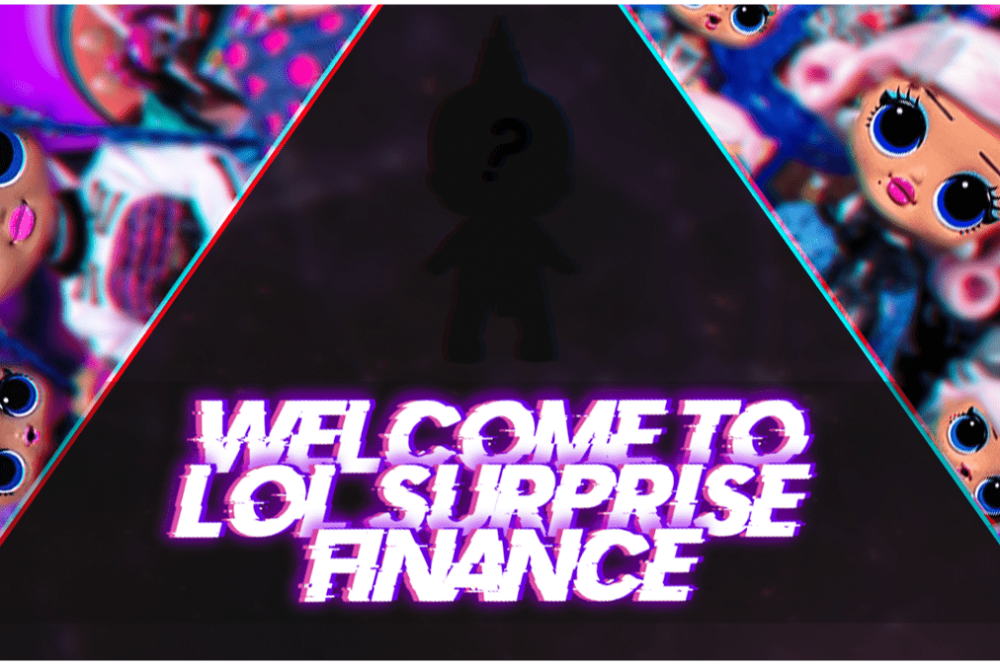

LOL Surprise Finance是BSC（Binance Smart Chain）上的下一代多层收益农场，以社区为导向，对未来有很大的规划。
您和您的孩子都熟悉这些玩具。我们爱他们是因为他们给予我们所爱的人的情感，因为所有人都喜欢惊喜，对吧？我们是一个经验丰富的开发人员团队，他们希望将这些情绪数字化，特别是在加密货币的世界中。
我们希望使项目尽可能透明，因为我们讨厌阻碍加密行业发展并欺骗投资者的不诚实项目。在农场开始之前，我们的智能合约代码将通过 RugDoc 的 KYC 验证和 TechRate 的审计。
在 LOL Surprise FInance，收益农场之后的主要优先事项之一将是在 OpenSea 和 Airnfts 上创建 LOL NFT 集合，这将在项目开发的同时获得其价值。
很多有趣的事情等着我们，我们想在metaverse中开发一个项目，以LOL玩具为主题，创建我们自己的虚拟现实游戏世界。很快我们将宣布预售开始、公平发布、第一层农场发布和第一个 NFT 收集日期的发布。
订阅我们的社交网络以了解最新的项目新闻！

