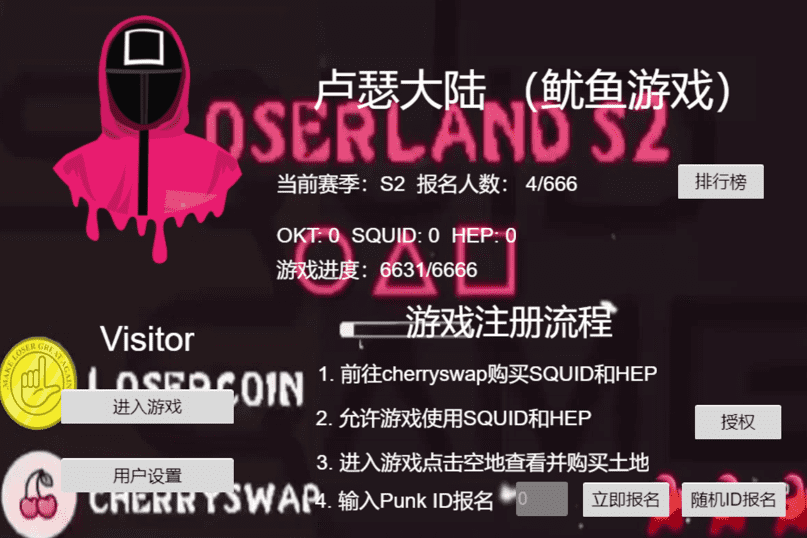

Loser Land是LoserCoin社区开发的一款2D开放世界回合制游戏。当前赛季是“鱿鱼游戏”，玩家可以互相攻击，在游戏结束时存活下来并分享池中的所有奖金。人们需要先购买一块土地来玩这个游戏，这在cherryswap中花费了两美元的鱿鱼。所有 $squid 都将累积在池中。进入游戏后，玩家可以在地图中四处走动，盖房子、鱼塘或矿井，与邻居打架，在游戏中挖/钓$鱿鱼。想开始旅程吗？保重，祝你们好运。下一季《向日葵农场》即将上线，敬请期待！

