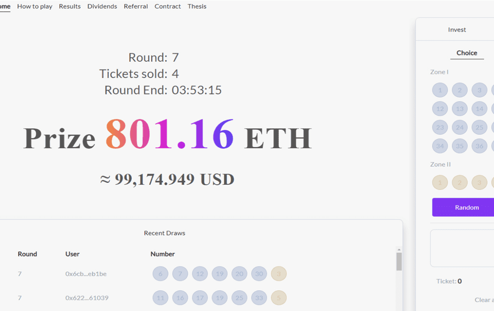

---
title: "Lottoshi"
description: "Lottoshi 是一种基于区块链的彩票"
date: 2022-08-17T00:00:00+08:00
lastmod: 2022-08-17T00:00:00+08:00
draft: false
authors: ["boogArno"]
featuredImage: "lottoshi.png"
tags: ["Gambling","Lottoshi"]
categories: ["nfts"]
nfts: ["Gambling"]
blockchain: "ETH"
website: "https://lottoshi.io/"
twitter: "https://twitter.com/Lottoshi1"
discord: ""
telegram: ""
github: ""
youtube: ""
twitch: ""
facebook: ""
instagram: ""
reddit: ""
medium: "https://medium.com/@lottoshi"
steam: ""
gitbook: ""
googleplay: ""
appstore: ""
status: "Live"
weight: 
lightgallery: true
toc: true
pinned: false
recommend: false
recommend1: false
---
Lottoshi 是一种基于区块链的彩票，它将通过智能合约运行，其中机制已定义且不可更改。这是世界上第一个将代币销售合约与产品结合起来，在区块链上与智能合约进行交互的彩票游戏。 Lottoshi 以赌注计算利润，让每个人都有机会加入。邀请合作者、见证人、玩家加入。投资者和赞助商将能够在我们的公开代币销售中购买 LTS。

