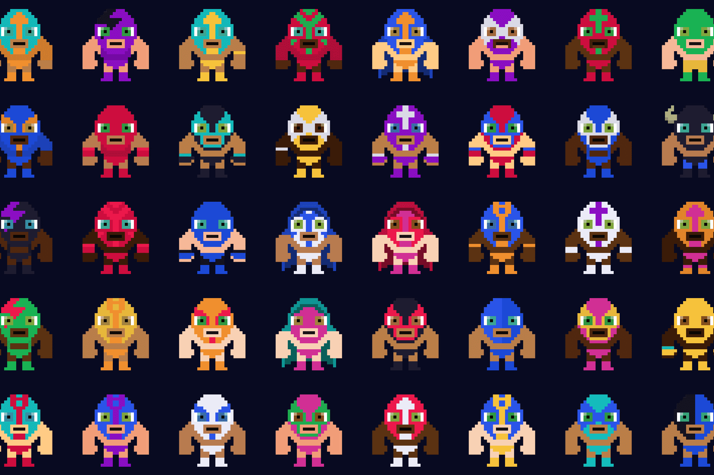

Luchador NFT 是在购买时使用 Chainlink VRF 随机生成的。

  100% 链上艺术和元数据
  最多8个稀有属性
  10,000 最大供应量
  数百万种可能的组合
  兼容 OpenSea

价格与 2 LINK 的价值挂钩，但以 ETH 支付。
我们使用 Uniswap V2 路由器将您的 ETH 转换为 LINK，以资助 Chainlink 随机数生成器。
一旦我们的智能合约收到随机数，我们就会生成您独特的 luchador NFT，其中包含多达 8 个稀有属性以及存储在以太坊区块链上的所有艺术品。

