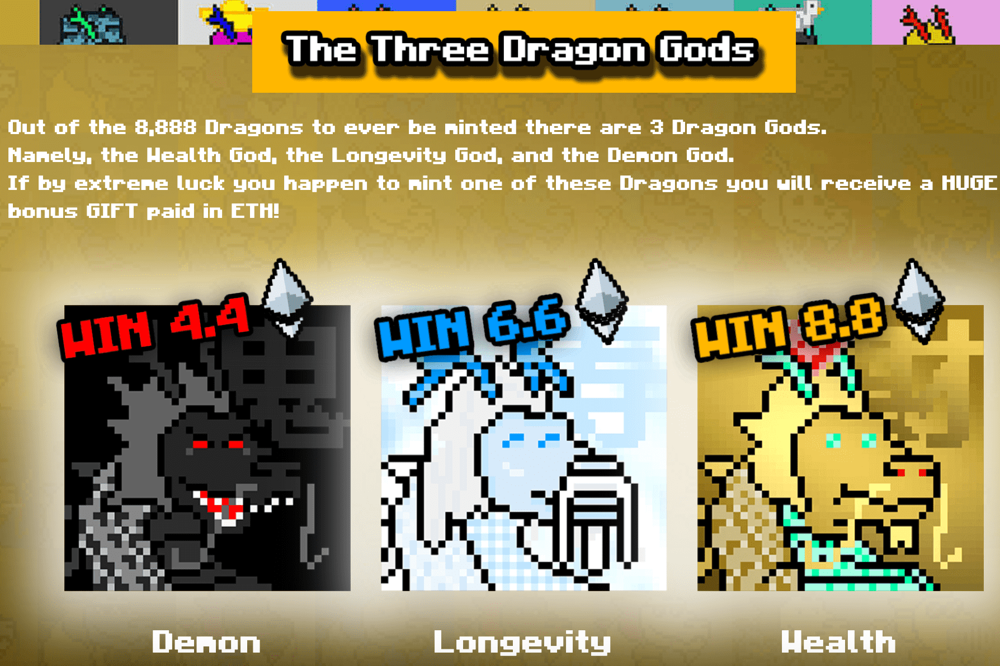

---
title: "Lucky Dragons"
description: "幸运龙是以太坊网络上随机生成的 8,888 条龙。随着时间的推移，它们会增加稀有度."
date: 2022-08-17T00:00:00+08:00
lastmod: 2022-08-17T00:00:00+08:00
draft: false
authors: ["boogArno"]
featuredImage: "lucky-dragons.png"
tags: ["Collectibles","Lucky Dragons"]
categories: ["nfts"]
nfts: ["Collectibles"]
blockchain: "ETH"
website: "https://luckydragons.fun/"
twitter: "https://twitter.com/TheLuckyDragons"
discord: ""
telegram: ""
github: ""
youtube: ""
twitch: ""
facebook: ""
instagram: "https://instagram.com/LuckDragonNfts"
reddit: ""
medium: ""
steam: ""
gitbook: ""
googleplay: ""
appstore: ""
status: "Live"
weight: 
lightgallery: true
toc: true
pinned: false
recommend: false
recommend1: false
---
幸运龙是以太坊网络上随机生成的 8,888 条龙。每条龙都被结合到一个实际分配的元数据中，这些元数据会影响它的背景、颜色、皮肤、配饰和稀有度。有些龙比其他龙稀有得多。所有二次销售的1%将用于扫地和烧龙，使剩余的更加稀有。社区抽奖和彩票不会让人失望。访问我们的网站以获取完整的实用程序和路线图。加入我们的 Discord 并进入 Dragon Lair 以获得独家赠品。

