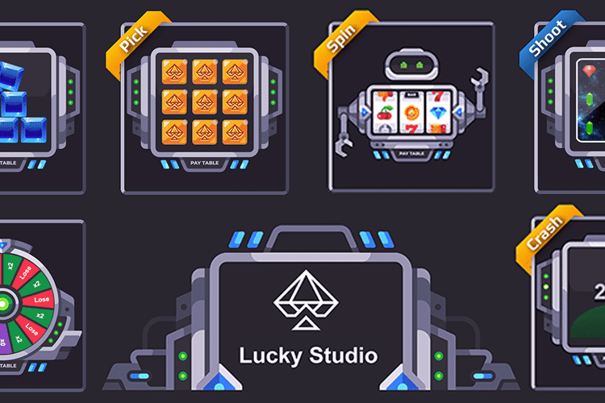

---
title: "Lucky Studio"
description: "Lucky Studio 专注于通过 Play To Earn 游戏和应用构建和开发全面的 DeFi 生态系统"
date: 2022-08-17T00:00:00+08:00
lastmod: 2022-08-17T00:00:00+08:00
draft: false
authors: ["boogArno"]
featuredImage: "lucky-studio.png"
tags: ["Gambling","Lucky Studio"]
categories: ["nfts"]
nfts: ["Gambling"]
blockchain: "BSC"
website: "https://luckystudio.app/"
twitter: "https://twitter.com/luckystudio_app"
discord: ""
telegram: ""
github: ""
youtube: ""
twitch: ""
facebook: "https://www.facebook.com/luckystd"
instagram: ""
reddit: ""
medium: ""
steam: ""
gitbook: ""
googleplay: ""
appstore: ""
status: "Live"
weight: 
lightgallery: true
toc: true
pinned: false
recommend: false
recommend1: false
---
集中心化与去中心化相结合的金融博弈
⁃ 购买 LUC 代币并将其保存在您的钱包中。股权或提供流动性。您将获得钻石来玩游戏
⁃ LUC 将根据 100 位钻石拥有者的排名或总投注额每周支付（2 桌奖励 2）
⁃ 您可以购买钻石 = LUC 或交换钻石/总赌注来争夺冠军
⁃ Staking单个LUC APY最高1000%未锁定，可随时提现
⁃ 更多功能正在更新中……
应用程序可在 appstore 和 googleplay
代币经济学：
⁃ 15% 用于质押单个 LUC
⁃ 10% 每周支付顶级玩家（每周 ~ 2%）
⁃ 70% 投入 pancakeswap 流动性供应
⁃ 5% 用于开发

