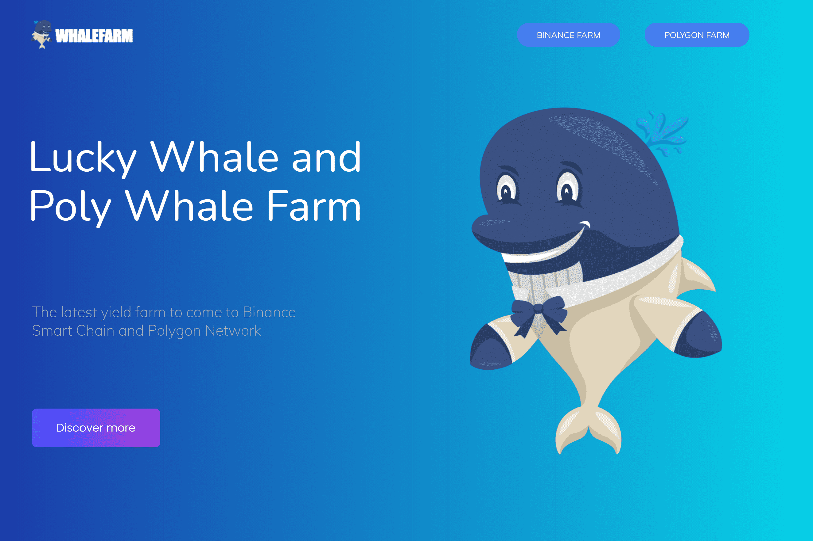

---
title: "Lucky Whale Farm"
description: "幸运鲸养殖场是一个多链高产养殖场."
date: 2022-08-17T00:00:00+08:00
lastmod: 2022-08-17T00:00:00+08:00
draft: false
authors: ["boogArno"]
featuredImage: "lucky-whale-farm.png"
tags: ["DeFi","Lucky Whale Farm"]
categories: ["nfts"]
nfts: ["DeFi"]
blockchain: "BSC"
website: "https://binance.luckywhale.farm/"
twitter: "https://twitter.com/luckywhalefarm"
discord: ""
telegram: "https://t.me/luckywhalefarmdefi"
github: ""
youtube: ""
twitch: ""
facebook: ""
instagram: ""
reddit: ""
medium: ""
steam: ""
gitbook: ""
googleplay: ""
appstore: ""
status: "Live"
weight: 
lightgallery: true
toc: true
pinned: false
recommend: false
recommend1: false
---
🐳幸运鲸农场🐳
🅿️白鲸农场🅿️
🐳反鲸🐳
🙌液化和交换🙌
🚀4% 的流动性🚀
🔥1% 燃烧🔥

幸运鲸养殖场统计
该数据代表被跟踪智能合约的原始链上活动

