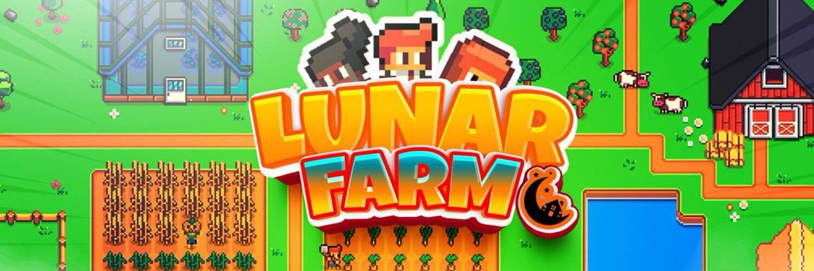

照顾你的农场并获得更多资源
在月球农场，你是一个月球人，最终来到地球上获取资源，因为在你的星球上它们用完了。地球是一个由自然环境组成的世界，您必须在其中收集大量资源并用这些资源建立您的农场。
您的 Lunar（您的化身）工作得越多越好，您将获得越多的资源，这将允许您通过将这些资源出售给其他 Lunars 并将您的游戏内资源兑换成我们的原生代币 $ 来获得我们的 $LFC 治理代币L

CASH。