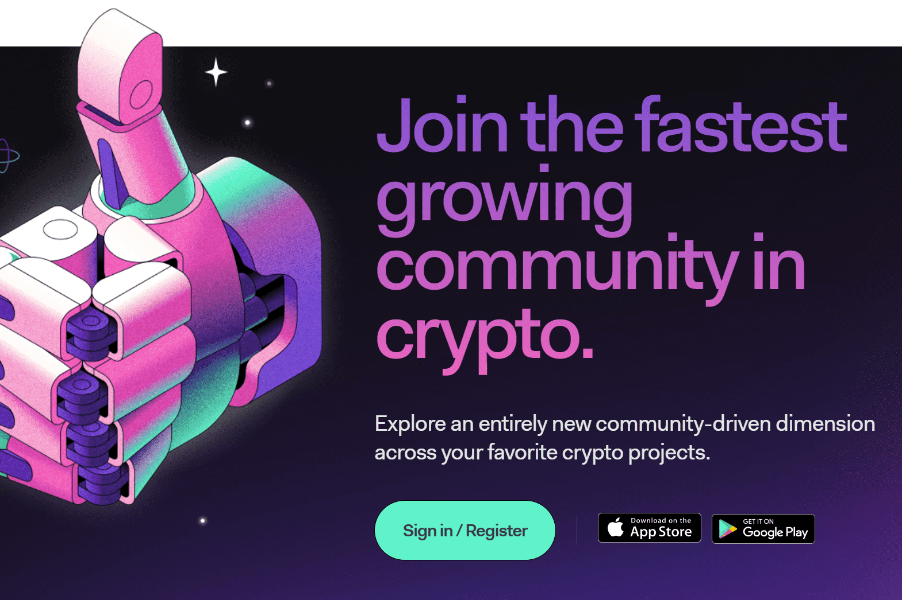

---
title: "Lunrcrush"
description: "我们聆听社交媒体中的每一滴加密信息，并将其提炼成可消化的数据，以帮助您做出明智的决定."
date: 2022-08-17T00:00:00+08:00
lastmod: 2022-08-17T00:00:00+08:00
draft: false
authors: ["boogArno"]
featuredImage: "lunrcrush.png"
tags: ["Social","Lunrcrush"]
categories: ["nfts"]
nfts: ["Social"]
blockchain: "Zilliqa"
website: "https://lunarcrush.com/"
twitter: "https://twitter.com/LunarCrush/photo"
discord: "https://discord.com/invite/Y5BAhGs"
telegram: "https://t.me/lunarcrush"
github: ""
youtube: ""
twitch: ""
facebook: ""
instagram: "https://www.instagram.com/lunarcrush_app/"
reddit: ""
medium: ""
steam: ""
gitbook: ""
googleplay: ""
appstore: ""
status: "Live"
weight: 
lightgallery: true
toc: true
pinned: false
recommend: false
recommend1: false
---
LunarCrush 收集社交媒体上有关比特币的活动、数以千计的 alt 和交易所，以及有影响力的人发布的内容，并将其提炼成易于消化的小块。
您使用 LunarCrush 的次数越多，它就会变得越聪明，了解您感兴趣或不感兴趣的内容。通过将收藏夹、馆藏和提醒添加到您的帐户，您将获得对您最重要的社交数据。

