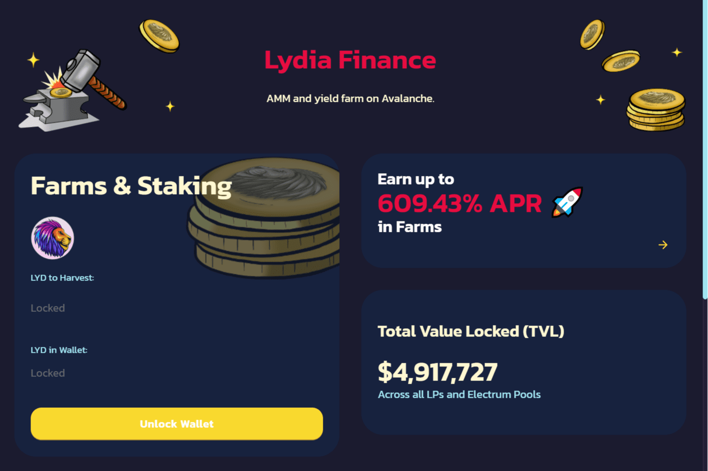

---
title: "Lydia Finance"
description: "雪崩上的快乐农作"
date: 2022-08-17T00:00:00+08:00
lastmod: 2022-08-17T00:00:00+08:00
draft: false
authors: ["boogArno"]
featuredImage: "lydia-finance.png"
tags: ["DeFi","Lydia Finance"]
categories: ["nfts"]
nfts: ["DeFi"]
blockchain: "Avalanche"
website: "https://www.lydia.finance/"
twitter: "https://twitter.com/LydiaFinance"
discord: "http://discord.gg/5sBmmVFSqk"
telegram: "https://t.me/LydiaFinance"
github: ""
youtube: ""
twitch: ""
facebook: ""
instagram: ""
reddit: ""
medium: ""
steam: ""
gitbook: ""
googleplay: ""
appstore: ""
status: "Live"
weight: 
lightgallery: true
toc: true
pinned: false
recommend: false
recommend1: false
---
Lydia Finance 是 Avalanche 上的自动化做市商、收益农业和 Staking 平台。我们拥有一支由经验丰富的开发人员组成的专门团队，他们已经在加密领域工作了多年。 $LYD 是我们平台的原生货币。在 Lydia Finance 上质押、汇集和赚取 $LYD 和许多其他代币实用程序。

