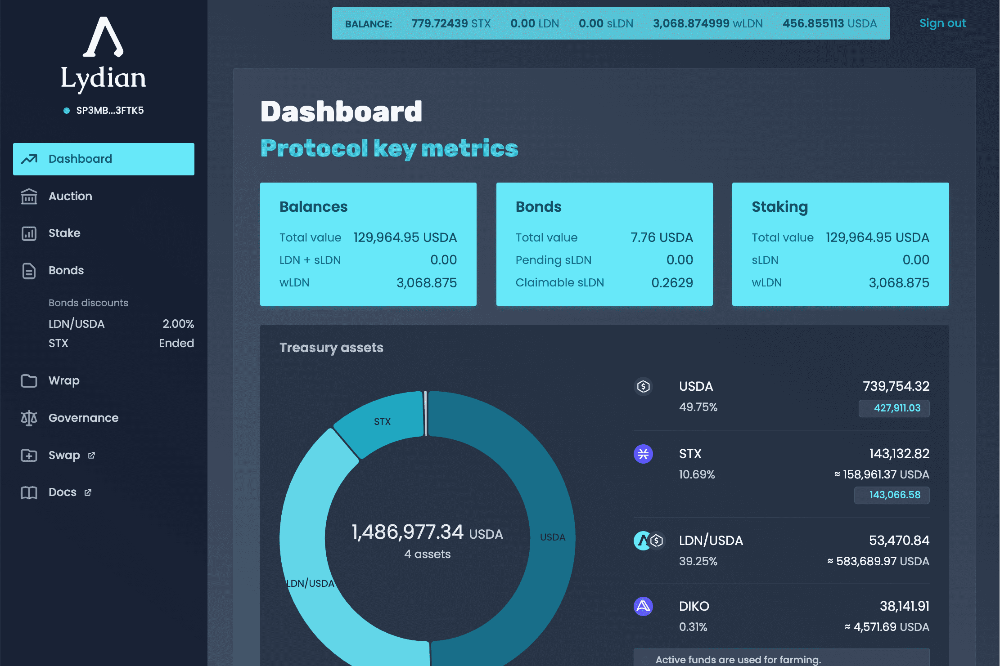

---
title: "Lydian DAO"
description: "Lydian 是一个志同道合的农民社区，他们在 Stacks 上一起收割庄稼."
date: 2022-08-17T00:00:00+08:00
lastmod: 2022-08-17T00:00:00+08:00
draft: false
authors: ["boogArno"]
featuredImage: "lydian-dao.png"
tags: ["DeFi","Lydian DAO"]
categories: ["nfts"]
nfts: ["DeFi"]
blockchain: "Stacks"
website: "https://www.lydian.xyz/"
twitter: "https://twitter.com/Lydian_DAO"
discord: ""
telegram: ""
github: ""
youtube: ""
twitch: ""
facebook: ""
instagram: ""
reddit: ""
medium: "https://medium.com/@tribunusgracchus"
steam: ""
gitbook: ""
googleplay: ""
appstore: ""
status: "Live"
weight: 
lightgallery: true
toc: true
pinned: false
recommend: false
recommend1: false
---
Lydian 是 Stacks 上的一个活跃的资金管理协议，它使用 DeFi 必须提供的最佳技术，例如协议拥有的流动性、质押和绑定。随着国库在农业战略中的部署，成员将看到他们在国库中所占份额的价值上升。
Lydian 通过发行利润丰厚的债券在国库中筹集资金，以换取我们的 LDN 代币。 LDN 代币代表了不断增长的国库份额，因为它在 Stacks 生态系统的收益农场中由 Lydian 的成员积极管理，并为 Lydian 的成员服务。简而言之，由于在 Stacks 必须提供的所有最佳协议中对金库的积极管理，成员将从金库的增长中受益。
Lydian 的成员组成一个 DAO 或公会，共同决定协议的未来。该治理系统决定了协议的参数，还决定了国库农业策略。

